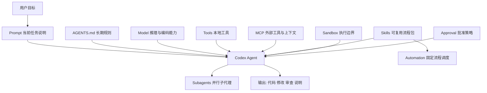

# Codex 相关概念与理解

本文基于 OpenAI 官方文档整理，更新时间为 `2026-03-24`。重点解释 Codex 体系里最容易混淆的一组概念：`agent`、`model`、`tool`、`MCP`、`skill`、`AGENTS.md`、`subagent`、`sandbox`、`approval`、`automation`。

## 1. 一句话总览

最实用的理解方式是：

```text
Codex = 模型 + 上下文 + 规则 + 工具 + 安全边界 + 工作流
```

它不是单纯的“聊天问答工具”，而是一个能够在受控边界内读取代码、修改文件、运行命令、调用外部系统并持续完成任务的编码 agent。

## 2. 先建立整体心智模型

可以把 Codex 想成一个软件工程团队里的数字化执行单元：

- `Model` 是大脑，负责理解和推理
- `Prompt` 是当前任务说明
- `AGENTS.md` 是长期工作守则
- `Tool` 是手和脚
- `MCP` 是接外部世界的插座
- `Skill` 是可复用的工作方法包
- `Subagent` 是你临时拉来的并行同事
- `Sandbox` 和 `Approval` 是安全护栏
- `Automation` 是定时运行的固定流程

如果把这些混成一团，就会出现常见问题：

- 明明应该写进 `AGENTS.md` 的长期规则，却每次都重新打一遍 prompt
- 明明应该做成 `skill` 的重复流程，却反复复制长提示词
- 明明应该接 `MCP` 的外部信息，却硬塞进上下文
- 明明只是权限不够，却误以为模型能力不够

## 3. 核心概念逐个解释

### 3.1 Agent

`Agent` 是“能完成任务的系统”，不是单独一个模型。

在 OpenAI 官方定义里，agent 是能够从简单目标到复杂开放式工作流完成任务的系统。它通常包含：

- 模型
- 指令
- 工具
- 上下文
- 控制逻辑
- 安全约束

放到 Codex 中，当前这个工作线程本身就可以视为一个 agent。它不是只会回答，而是会：

- 理解目标
- 读取代码和文件
- 规划步骤
- 执行命令
- 修改内容
- 汇总结果

所以，`agent` 更像“可行动的工作单元”，而不是“会说话的模型”。

### 3.2 Model

`Model` 是 agent 的推理核心，也就是大脑。

它决定了：

- 编码能力上限
- 推理深度
- 速度
- 成本
- 对长任务和复杂上下文的处理效果

截至 `2026-03-24`，OpenAI 官方对 Codex 的建议是：

- 大多数任务从 `gpt-5.4` 开始
- 更轻量、更便宜的任务可以用 `gpt-5.4-mini`
- `gpt-5.3-codex` 是专门面向复杂软件工程任务的强编码模型

需要特别区分：

- `model` 决定“能想多好”
- `tool` 决定“能做什么”
- `sandbox/approval` 决定“能做到什么程度”

### 3.3 Prompt

`Prompt` 是你当前这一次任务的输入说明。

它解决的是“这次具体要做什么”。官方建议最少说清四件事：

- `Goal`
- `Context`
- `Constraints`
- `Done when`

对中文用户，可以直接理解为：

- 目标
- 上下文
- 约束
- 完成标准

Prompt 适合表达当前任务，不适合承载长期规则。

### 3.4 Tool

`Tool` 是 agent 的执行能力。

没有工具时，模型只能输出文本；有了工具之后，它才能变成真正能行动的 agent。

在 Codex 语境下，常见工具包括：

- 读取文件
- 修改文件
- shell 命令执行
- 网页搜索
- 本地环境
- MCP server
- 代码审查相关能力

要点是：

- 模型负责判断和决策
- 工具负责实际行动

### 3.5 MCP

`MCP` 是 `Model Context Protocol`。

它本质上是一个标准协议，用来把模型连接到外部工具和外部上下文。官方给出的典型用途包括：

- 第三方文档
- 浏览器
- Figma
- 开发工具

在 Codex 里，MCP 的意义是“让 agent 接触仓库之外、会变化、需要实时访问的信息和系统”。

官方说明里，Codex 支持两类 MCP server：

- `STDIO`：本地命令启动的进程型 server
- `Streamable HTTP`：通过地址访问的远程 server

它适合解决的问题是：

- 文档不在仓库里
- 工具不在本地 shell 内置能力里
- 需要和浏览器、设计稿、监控平台、第三方系统交互

一句话理解：

`MCP 不是提示词，也不是工作流，它是外部能力接入协议。`

### 3.6 Skill

在 Codex 里，`skill` 是“可复用的工作方法包”。

官方定义非常明确：skill 用于给 Codex 增加任务特定能力，一个 skill 会打包：

- instructions
- resources
- optional scripts

它的核心目标是：让某类流程被稳定、重复地执行。

典型场景：

- 日志排查
- PR 审查清单
- 迁移计划
- 发布说明草拟
- 固定化调试流程

一个 skill 通常是一个目录，核心文件是 `SKILL.md`，还可以带：

- `scripts/`
- `references/`
- `assets/`
- `agents/openai.yaml`

Codex 对 skill 采用渐进加载机制：

- 先看 skill 元数据
- 需要时再读取完整 `SKILL.md`

这意味着 skill 不是普通说明文档，而是一个可触发、可维护、可共享的流程单元。

### 3.7 AGENTS.md

`AGENTS.md` 是“长期有效的工作规则和项目上下文”。

官方说明中，Codex 在开始工作前会主动读取 `AGENTS.md`。而且它不是只读一个文件，而是按层级叠加：

- 全局级别：`~/.codex/AGENTS.md`
- 仓库级别：仓库根目录 `AGENTS.md`
- 子目录级别：离当前工作目录更近的 `AGENTS.md` 或 `AGENTS.override.md`

它适合放的内容包括：

- 仓库结构说明
- 如何启动项目
- 测试、lint、build 命令
- 代码规范
- 禁改区域
- 完成标准

一句话理解：

`Prompt` 负责一次性任务，`AGENTS.md` 负责长期规则。

### 3.8 Subagent

`Subagent` 是并行的子代理。

官方文档说明，Codex 可以显式按你的要求拉起多个专门 agent 并行工作，然后汇总结果。它特别适合：

- 复杂代码库探索
- 多步骤功能拆分
- 并行查问题
- 多模块审查

它的优势：

- 并行
- 专门化
- 降低单线程上下文污染

它的代价：

- token 消耗更高
- 协调更复杂
- 不适合所有小任务

关键点：

- Codex 不会默认乱开 subagent
- 通常需要你明确提出并行或委派需求

### 3.9 Sandbox

`Sandbox` 是执行边界。

它解决的是：Codex 能读哪里、写哪里、执行到什么范围。

官方常见模式包括：

- `read-only`
- `workspace-write`
- `danger-full-access`

其中最常用的是：

- `read-only`：适合纯分析
- `workspace-write`：适合日常开发
- `danger-full-access`：风险最高，只适合你明确知道自己在做什么时使用

要点：

- sandbox 控制技术权限
- 它不是模型能力设置

### 3.10 Approval Policy

`Approval` 是批准策略。

它解决的是：当 Codex 需要做某些动作时，要不要先问你。

常见值：

- `untrusted`
- `on-request`
- `never`

常见理解：

- `untrusted`：只有可信操作自动执行，其他要问
- `on-request`：模型觉得需要越界时会问
- `never`：不问，失败就直接返回

需要特别注意：

- `sandbox` 是“围栏有多大”
- `approval` 是“出围栏前要不要问”

两者不是一个概念。

### 3.11 Automation

`Automation` 是“固定流程的定时或后台运行”。

官方最佳实践给出一个很实用的判断标准：

- `skill` 负责方法
- `automation` 负责调度

也就是说：

- 如果一套流程还不稳定，先做成 skill
- 如果已经稳定且经常重复，才适合做 automation

典型自动化场景：

- 定期总结提交
- 定时扫描问题
- 定时检查 CI 失败
- 自动生成例行报告

## 4. 最容易混淆的几组概念

### 4.1 Agent 和 Model

不要把 agent 等同于 model。

关系是：

- `Model` 是大脑
- `Agent` 是大脑加工具、上下文、规则、流程之后的工作系统

所以，“换模型”不等于“换工作流”；“能力不足”也不一定是模型弱，有时候只是工具没接上、上下文不够、权限太小。

### 4.2 Prompt 和 AGENTS.md

区别非常明确：

- `Prompt` 解决当前任务
- `AGENTS.md` 解决长期约束

例如：

- “帮我修首页白屏”应写在 prompt
- “修改 JS 后必须跑 npm test”应写在 `AGENTS.md`

### 4.3 Skill 和 Prompt

区别是复用性。

- `Prompt` 是一次性的任务描述
- `Skill` 是反复复用的方法封装

如果你发现自己反复复制同一类长提示词，通常说明它应该升级成 skill。

### 4.4 Skill 和 MCP

这两个最容易被混淆。

正确理解是：

- `Skill` 是“怎么做”
- `MCP` 是“连到哪里做”

举例：

- “排查线上错误的固定流程”适合做成 skill
- “连接 Sentry、Figma、文档中心”适合通过 MCP

skill 更像 SOP，MCP 更像接口和连接器。

### 4.5 Skill 和 AGENTS.md

区别在于是否“流程化”。

- `AGENTS.md` 讲长期规则
- `Skill` 讲特定任务流程

例如：

- “本仓库统一用 pnpm”放 `AGENTS.md`
- “如何做支付模块故障排查”做成 skill

### 4.6 Sandbox 和 Approval

很多人第一次用 Codex 时，会把这两个混为一谈。

其实：

- `sandbox` 决定它 physically 能做什么
- `approval` 决定它做之前是否问你

一个常见组合是：

```text
sandbox_mode = "workspace-write"
approval_policy = "on-request"
```

这代表：

- 可以在工作区里改东西和跑常规命令
- 一旦要越过边界，就来问你

## 5. 什么时候该用什么

### 当前任务需要说明

用 `prompt`

### 个人或项目长期规则

用 `AGENTS.md`

### 重复出现的工作流程

用 `skill`

### 仓库外的实时工具或外部上下文

用 `MCP`

### 需要并行拆任务

用 `subagent`

### 想控制风险

调整 `sandbox` 和 `approval`

### 想定期自动跑

用 `automation`

## 6. 一张关系图



## 7. 一套最实用的工程理解

如果你是中文开发者，记下面这组就够用了：

```text
Prompt 说明这次做什么
AGENTS.md 规定长期怎么做
Skill 封装重复流程
MCP 接入外部工具和数据
Subagent 负责并行分工
Sandbox 和 Approval 负责安全
Automation 负责周期性执行
```

## 8. 常见误区

### 误区 1：Codex 就是会写代码的聊天工具

不准确。它更接近一个受控的编码 agent。

### 误区 2：只要模型够强，就不用配工具

不准确。没有工具，模型很多时候只能“知道”，不能“做到”。

### 误区 3：长 prompt 就等于高级用法

不一定。重复长 prompt 往往说明你需要 `AGENTS.md` 或 `skill`。

### 误区 4：权限开到最大，结果就一定更好

不对。更大权限只意味着更高风险，不代表结果一定更优。

### 误区 5：MCP 就是插件市场

不准确。MCP 更像标准协议层，用来接工具和上下文，不只是“安装插件”。

## 9. 给中文用户的落地建议

### 建议 1

把这类长期偏好写进 `~/.codex/AGENTS.md`：

- 全程用中文解释，但保留代码和命令原文
- 修改代码后优先跑测试
- 不要主动引入新依赖，除非先说明原因
- 最终回复包含改动、验证、风险

### 建议 2

如果你反复做这些事，就该考虑 skill：

- 修某类线上错误
- 做固定格式的代码审查
- 出版本说明
- 排查某个服务的日志

### 建议 3

如果你常用这些外部系统，就该考虑 MCP：

- 官方文档
- 设计稿系统
- 浏览器
- 监控平台
- issue 系统

### 建议 4

第一次上手时，优先用这组安全配置：

```toml
model = "gpt-5.4"
approval_policy = "on-request"
sandbox_mode = "workspace-write"
```

## 10. 官方文档要点索引

- Agents：agent 是能完成任务的系统
- Best Practices：把 Codex 当作可配置队友，而不是一次性助手
- AGENTS.md：长期规则分层叠加，越靠近当前目录越具体
- Skills：可打包 instructions、resources、optional scripts
- MCP：给 Codex 接入第三方工具和外部上下文
- Subagents：显式要求时并行拉起专门 agent
- Sandboxing：`workspace-write` 是本地工作最常用的低摩擦模式
- Approvals：`--full-auto` 本质是 `workspace-write + on-request`

## 11. 参考资料

- https://developers.openai.com/api/docs/guides/agents
- https://developers.openai.com/codex/learn/best-practices
- https://developers.openai.com/codex/guides/agents-md
- https://developers.openai.com/codex/skills
- https://developers.openai.com/codex/mcp
- https://developers.openai.com/codex/subagents
- https://developers.openai.com/codex/concepts/sandboxing
- https://developers.openai.com/codex/agent-approvals-security
- https://developers.openai.com/codex/models
